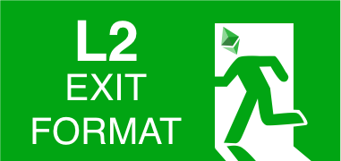

<p align="center">
  
</p>

**Standard Exit Format for L2s built on EVM chains**

We present a general standard for such a format, along with coders written in Typescript and Cairo, which will aid L2 interoperability and support arbitrary tokens

The idea behind this library is to standardise the data structures used in exiting a layer 2 system: whether that is a [Connext](https://connext.network/) state channel or a rollup such as [Arbitrum](https://offchainlabs.com/) or [Optimism](https://optimism.io/). An exit format allows one to specify how assets locked up and redistributed in an L2 should be paid out in L1.  Our hope is that as many layer 2 projects as possible can contribute to this repo and consider adopting the format in their system. If that happens, it should enable greater interoperability between these layer 2s, which otherwise are a little bit silo-ed.

We have concentrated so far on a format that works for [Nitro state channels](https://medium.com/magmo/nitro-protocol-c49b50f59df7). While working on the hack we realised that the new format actually enables us to streamline our virtual channel construction: leading to much greater simplicity and lowering the gas costs for channel disputes. The nitro specific code can be found in `/nitro-src` and is not currently exported from the npm package.

As another bonus, we have also built the beginnings of a zero-knowledge proof mechanism, which will allow Nitro state channels to scale even farther beyond their current limit and bring gas costs down even further. This work-in-progress currently takes the form of some [cairo](https://www.cairo-lang.org/) code in the `/cairo` directory, and is alo not currently exported from the npm package. There's another readme in that folder that explains more. 

**How to install this package**
```shell
yarn add @statechannels/exit-format
```

**Example usage**

```solidity
// SPDX-License-Identifier: MIT
pragma solidity 0.8.4;

import "@statechannels/exit-format/contracts/ExitFormat.sol";

contract MyLayer2 {
    bytes32 exitHash;

    function storeExitHash(ExitFormat.SingleAssetExit[] memory exit) public {
        if (msg.sender == 0x0737369d5F8525D039038Da1EdBAC4C4f161b949) {
            exitHash = keccak256(ExitFormat.encodeExit(exit));
        }
    }

    function payout(ExitFormat.SingleAssetExit[] memory exit) public {
        if (keccak256(ExitFormat.encodeExit(exit)) == exitHash) {
            ExitFormat.executeExit(exit);
        }
    }
}
```

```typescript
import { Exit, SingleAssetExit } from "@statechannels/exit-format";

const ethExit: SingleAssetExit = {
  asset: "0x0000000000000000000000000000000000000000", // this implies an ETH token
  data: "0x",
  allocations: [
    {
      destination: "0x96f7123E3A80C9813eF50213ADEd0e4511CB820f", // Alice
      amount: "0x05",
      callTo: "0x0000000000000000000000000000000000000000", // a regular ETH transfer
      data: "0x",
    },
    {
      destination: "0x0737369d5F8525D039038Da1EdBAC4C4f161b949", // Bob
      amount: "0x05",
      callTo: "0x96f7123E3A80C9813eF50213ADEd0e4511CB820f", // this implies "call a WithdrawHelper"
      data: "0x0123", /// ... with this calldata
    },
  ],
};

const daiExit: SingleAssetExit = {
  asset: "0x6b175474e89094c44da98b954eedeac495271d0f ", // this implies DAI (an ERC20 token)
  data: "0x",
  allocations: [
    {
      destination: "0x96f7123E3A80C9813eF50213ADEd0e4511CB820f", // Alice
      amount: "0x05",
      callTo: "0x0000000000000000000000000000000000000000", // a regular ERC20.transfer
      data: "0x",
    },
    {
      destination: "0x96f7123E3A80C9813eF50213ADEd0e4511CB820f", // Bob
      amount: "0x05",
      callTo: "0x0000000000000000000000000000000000000000", // a regular ERC20.transfer
      data: "0x",
    },
  ],
};

const exit: Exit = [ethExit, daiExit];
```
